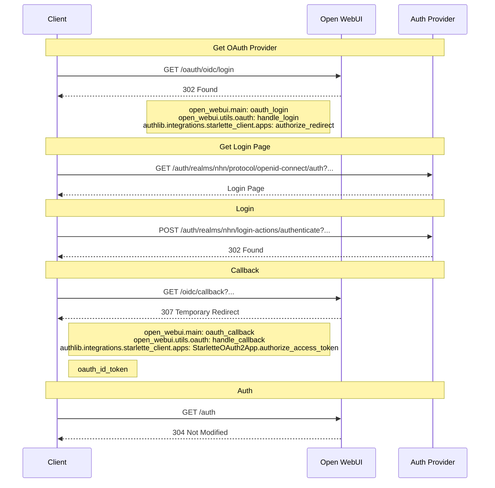

# Authorization & Authentication

## OAuth Process

```mermaid
sequenceDiagram

participant CLIENT as Client
participant BE as Open WebUI
participant PROVIDER as Auth Provider

note over CLIENT, PROVIDER: Get OAuth Provider
CLIENT ->> BE: GET /oauth/oidc/login
BE -->> CLIENT: 302 Found
note left of BE: open_webui.main: oauth_login<br>open_webui.utils.oauth: handle_login<br>authlib.integrations.starlette_client.apps: authorize_redirect

note over CLIENT, PROVIDER: Get Login Page
CLIENT ->> PROVIDER: GET /auth/realms/nhn/protocol/openid-connect/auth?...
PROVIDER -->> CLIENT: Login Page

note over CLIENT, PROVIDER: Login
CLIENT ->> PROVIDER: POST /auth/realms/nhn/login-actions/authenticate?...
PROVIDER -->> CLIENT: 302 Found

note over CLIENT, PROVIDER: Callback
CLIENT ->> BE: GET /oidc/callback?...
BE -->> CLIENT: 307 Temporary Redirect
note left of BE: open_webui.main: oauth_callback<br>open_webui.utils.oauth: handle_callback<br>authlib.integrations.starlette_client.apps: StarletteOAuth2App.authorize_access_token
note right of CLIENT: oauth_id_token

note over CLIENT, PROVIDER: Auth
CLIENT ->> BE: GET /auth
BE -->> CLIENT: 304 Not Modified
```
